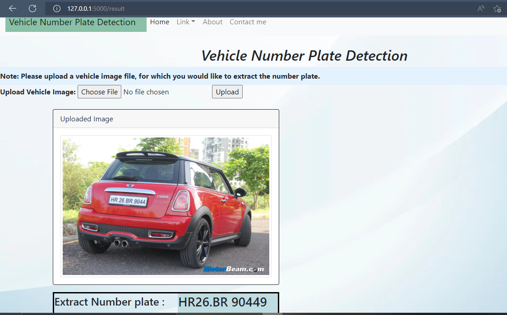

*Vehicle Number Plate Detection*
-
---

Installing
-
---
For the web application [Vehicle Number Plate Detection](link), the code is written in python 3.7.

- Create new environment.
- Install all the required packages and libraries using below command -  
```bash
pip install -r requirements.txt
```


Problem Statement 
-
---
Build a **Vehicle Number Plate Detection System** that should recognize many places with uttermost clarity in any circumstances. With a varying distance and colour combination, it should work for any Indian continent.


**Solution** - Built a web-application, user will give an input as vehicle image and provide the **extracted number from vehicle number plate** as result.

Tools & Technology used: 
-
---
```bash
- Python | OpenCV | PyTesseract | Tensorflow | Keras | Image Data-Processing | 
  Deep Learning | Flask-API | HTML | Bootstrap | GitHub | AWS
- TensorFlow Model: Inception-ResNet-v2
- OS : Windows
- git : GitHub
- IDE : PyCharm | Google Colab
```

Demo Screen-Shot:
-
---


---

Demo Video:
-
---
https://user-images.githubusercontent.com/82312234/179416611-86131acb-508e-466e-8daa-d7472556f97c.mp4

---